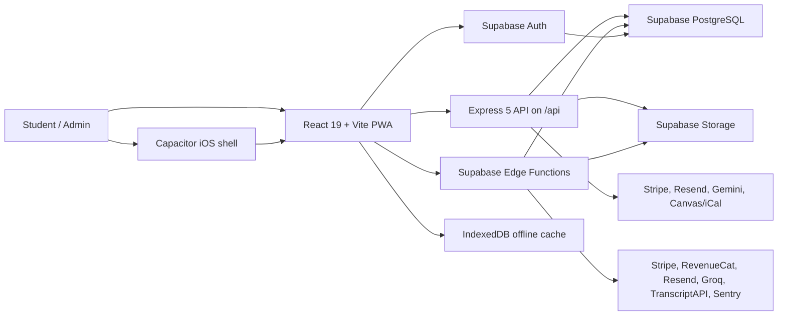
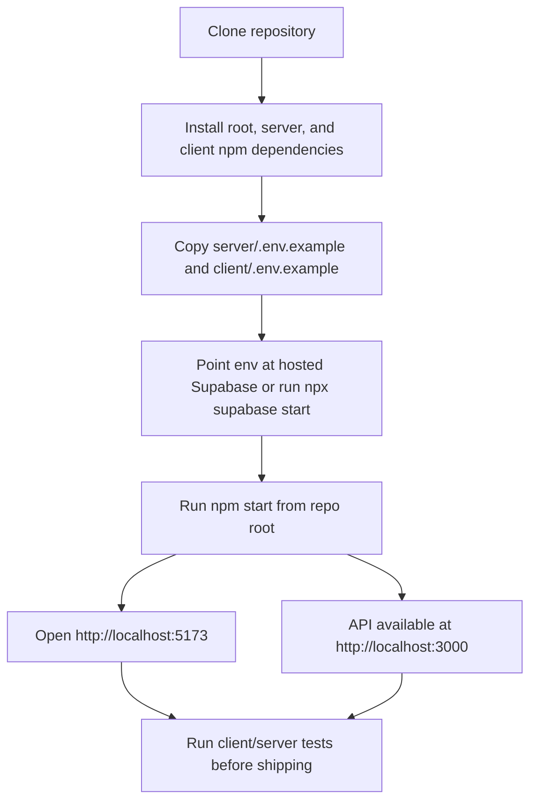

# Riven


Riven is a full-stack study platform for students: flashcards, notes, study guides, exams, class planning, Canvas calendar sync, study groups, social sharing, gamified focus loops, and a customizable PWA/iOS experience.

This README is the fast path for developers. Deeper product and release notes live in [`docs/`](docs/).

## Contents

- [Product Snapshot](#product-snapshot)
- [Stack](#stack)
- [Quickstart](#quickstart)
- [Environment](#environment)
- [Architecture](#architecture)
- [Scripts](#scripts)
- [Testing](#testing)
- [Deployment](#deployment)
- [Security And Observability](#security-and-observability)
- [Troubleshooting](#troubleshooting)
- [Project Docs](#project-docs)

## Product Snapshot

Riven combines student workflow tools that usually live in separate apps:

| Area | What Riven Supports |
| --- | --- |
| Study content | Decks, cards, notes, study guides, generated exams, YouTube imports, document/audio-assisted workflows |
| Practice | Flashcard study, test mode, FSRS-style scheduling fields, session completion tracking |
| Classes | Course records, assignments, calendar views, Canvas/iCal sync, semester cleanup flows |
| Groups | Study groups, shared decks/resources, scheduled meetups, collaborative cram/session flows |
| Social | Friends, messaging, profile customization, sharing, blocking/reporting primitives |
| Monetization | Stripe for web/PWA, RevenueCat/StoreKit for native iOS, hearts/free-tier gates |
| Native and PWA | Vite PWA, IndexedDB offline paths, Capacitor iOS wrapper, push/local notifications |
| Operations | Sentry, PostHog, Dependabot, rate limits, Turnstile, Supabase Edge Functions |

## Stack

| Layer | Main Tools |
| --- | --- |
| Runtime | Node.js 20+, npm, Deno for Supabase Edge Functions |
| Client | React 19, Vite 7, React Router, Tailwind CSS, Motion, GSAP, TipTap, Lucide |
| API | Express 5, Supabase Edge Functions, Zod-style validation utilities, `pg` |
| Data | Supabase PostgreSQL, Supabase Auth, Supabase Storage, IndexedDB via `idb` |
| AI | Google Gemini in Express AI routes, Groq-backed Edge AI flows where configured |
| Payments | Stripe for web checkout/billing portal/webhooks, RevenueCat for iOS IAP sync |
| Email and auth | Resend, Supabase Auth, Google OAuth, native Apple Sign-In, TOTP 2FA |
| Mobile | Capacitor 8 iOS project with native auth, notifications, haptics, and RevenueCat |
| Quality | Vitest, Testing Library, Supertest, ESLint, Dependabot |
| Hosting | Vercel for client and Express API, Supabase for database and Edge Functions |

## Quickstart

### Prerequisites

- Node.js 20+.
- npm, included with Node.
- A Supabase project, or the Supabase CLI plus Docker for local Supabase.
- Optional service accounts for Stripe, RevenueCat, Resend, Sentry, PostHog, Google/Apple auth, Groq/Gemini, Turnstile, and LMS integrations.

### Install

This repo has three npm projects: root orchestration, client, and server.

```bash
git clone <repo-url>
cd Riven

npm install
cd server && npm install && cd ..
cd client && npm install && cd ..
```

### Configure

```bash
cp server/.env.example server/.env
cp client/.env.example client/.env
```

At minimum, set:

- `server/.env`: `DATABASE_URL`, `JWT_SECRET`
- `client/.env`: `VITE_SUPABASE_URL`, `VITE_SUPABASE_ANON_KEY`

For hosted Supabase, use the project URL, anon key, service role key, and pooled PostgreSQL connection string from the Supabase dashboard. For local Supabase, start the local stack and copy values from the CLI output:

```bash
npx supabase start
```

### Run

```bash
npm start
```

Development URLs:

- Client: `http://localhost:5173`
- Express API: `http://localhost:3000`
- Vite proxies `/api` to the Express server in local development.

## Environment

Use the checked-in examples as the source of truth:

- [`server/.env.example`](server/.env.example)
- [`client/.env.example`](client/.env.example)

### Server

| Variable | Required | Purpose |
| --- | --- | --- |
| `DATABASE_URL` | Yes | PostgreSQL connection string, usually Supabase pooler or local Postgres |
| `JWT_SECRET` | Yes | Legacy/Express token signing secret |
| `FRONTEND_URL`, `CLIENT_URL` | Recommended | Redirect base URLs for auth, payments, and email links |
| `ALLOWED_ORIGINS` | Recommended | Comma-separated CORS origins for browser and native clients |
| `SUPABASE_URL`, `SUPABASE_ANON_KEY`, `SUPABASE_SERVICE_ROLE_KEY`, `SUPABASE_JWT_SECRET` | Feature-dependent | Supabase Auth, storage cleanup, bridge routes, and privileged operations |
| `STRIPE_SECRET_KEY`, `STRIPE_WEBHOOK_SECRET`, `STRIPE_PRICE_MONTHLY`, `STRIPE_PRICE_ANNUAL` | Payments | Web/PWA billing and webhook fulfillment |
| `GEMINI_API_KEY` | AI | Express AI card/document generation |
| `RESEND_API_KEY`, `EMAIL_FROM` | Email | Transactional email |
| `GOOGLE_CLIENT_ID`, `APPLE_CLIENT_ID`, `APPLE_TEAM_ID`, `APPLE_KEY_ID`, `APPLE_PRIVATE_KEY` | Auth | Legacy OAuth/native bridge fallbacks |
| `TURNSTILE_SECRET_KEY`, `ALLOW_CAPACITOR_REGISTER_SKIP_TURNSTILE` | Signup protection | Cloudflare Turnstile and native signup behavior |
| `SENTRY_DSN`, `SENTRY_ENVIRONMENT`, `SENTRY_RELEASE`, `SENTRY_TRACES_SAMPLE_RATE` | Observability | Express API error reporting |
| `PORT`, `HOST`, `NODE_ENV`, `DB_SSL` | Runtime | Local/server runtime controls |

### Client

| Variable | Required | Purpose |
| --- | --- | --- |
| `VITE_SUPABASE_URL`, `VITE_SUPABASE_ANON_KEY` | Yes | Supabase Auth, storage, and realtime client access |
| `VITE_API_URL` | Deployment-dependent | API base URL when the client and API are on different origins |
| `VITE_GOOGLE_WEB_CLIENT_ID` | Native Google auth | Web OAuth client ID used by the Capacitor Google Sign-In flow |
| `VITE_TURNSTILE_SITE_KEY`, `VITE_SKIP_TURNSTILE` | Signup protection | Cloudflare Turnstile widget and local-only bypass |
| `VITE_STRIPE_PRICE_MONTHLY`, `VITE_STRIPE_PRICE_ANNUAL` | Payments | Price IDs shown to web/PWA users |
| `VITE_RC_IOS_API_KEY` | Native iOS payments | RevenueCat public iOS API key |
| `VITE_SENTRY_DSN`, `VITE_SENTRY_ENVIRONMENT`, `VITE_SENTRY_RELEASE`, `VITE_SENTRY_TRACES_SAMPLE_RATE` | Observability | Browser/PWA/Capacitor WebView error reporting |
| `SENTRY_AUTH_TOKEN`, `SENTRY_ORG`, `SENTRY_PROJECT`, `SENTRY_RELEASE` | Build-time only | Client source map upload in CI/Vercel |
| `VITE_PUBLIC_POSTHOG_KEY`, `VITE_PUBLIC_POSTHOG_HOST` | Analytics | Optional PostHog product analytics |
| `VITE_ENABLE_LEGACY_AUTH_BRIDGE` | Compatibility | Enables legacy Express auth bridge paths |

### Supabase Edge Function Secrets

Set Edge Function secrets with the Supabase dashboard or CLI:

```bash
npx supabase secrets set STRIPE_SECRET_KEY=sk_...
npx supabase secrets set STRIPE_WEBHOOK_SECRET=whsec_...
npx supabase secrets set CLIENT_URL=https://your-web-app.example
```

Common secrets used by functions include:

| Secret | Purpose |
| --- | --- |
| `SUPABASE_URL`, `SUPABASE_ANON_KEY`, `SUPABASE_SERVICE_ROLE_KEY` | Supabase client/admin access |
| `STRIPE_SECRET_KEY`, `STRIPE_WEBHOOK_SECRET`, `STRIPE_PRICE_MONTHLY`, `STRIPE_PRICE_ANNUAL`, `STRIPE_TEST_COUPON` | Stripe checkout, portal, and webhooks |
| `CLIENT_URL`, `FRONTEND_URL`, `ALLOWED_ORIGINS` | CORS and redirect origins, especially for Capacitor origins |
| `RESEND_API_KEY`, `EMAIL_FROM` | Email delivery |
| `GROQ_API_KEY`, `AI_DRAFT_MODEL`, `AI_FINAL_MODEL`, `AI_JOB_RUNNER_SECRET` | Edge AI generation and queued jobs. Note processing defaults to `openai/gpt-oss-20b` for drafts and `openai/gpt-oss-120b` for final notes; set the two model secrets to override them. |
| `RC_WEBHOOK_SECRET`, `RC_SECRET_KEY`, `RC_IOS_API_KEY` | RevenueCat webhooks and sync |
| `CANVAS_AUTO_SYNC_SECRET` | Scheduled Canvas sync protection |
| `UPSTASH_REDIS_REST_URL`, `UPSTASH_REDIS_REST_TOKEN` | Edge rate limit backend |
| `TRANSCRIPTAPI_KEY` | YouTube transcript fallback (paid tier after free strategies) |
| `SENTRY_DSN`, `SENTRY_ENVIRONMENT`, `SENTRY_RELEASE`, `SENTRY_TRACES_SAMPLE_RATE` | Edge Function error reporting |

## Architecture





### Request Paths

| Path | Used For |
| --- | --- |
| React client to `/api/*` | Express routes for compatibility APIs, legacy auth bridges, selected AI/payment/LMS paths, and health checks |
| React client to Supabase | Auth, storage, PostgREST/realtime-backed behavior, and Edge Function calls |
| Supabase Edge Functions | Payments, account actions, AI jobs/generation, Canvas sync, group/session actions, RevenueCat, push dispatch |
| IndexedDB | Offline and cached client-side study data paths |

Socket.IO is intentionally not part of the current runtime; realtime behavior has been migrated away from the old Socket.IO dependency.

## Scripts

### Root

| Command | Description |
| --- | --- |
| `npm start` | Run server and client together with `concurrently` |
| `npm run server` | Start the Express server via `cd server && npm run dev` |
| `npm run client` | Start the Vite client via `cd client && npm run dev` |

### Server

```bash
cd server
```

| Command | Description |
| --- | --- |
| `npm run dev` | Start Express with nodemon |
| `npm start` | Start Express with Node |
| `npm test` | Run server Vitest/Supertest suite |
| `npm run backfill:study-sessions-schema` | Run the study sessions schema backfill helper |

### Client

```bash
cd client
```

| Command | Description |
| --- | --- |
| `npm run dev` | Start Vite |
| `npm run build` | Build production web/PWA assets |
| `npm run preview` | Preview the production build |
| `npm run lint` | Run ESLint |
| `npm test` | Run client Vitest/Testing Library suite |
| `npm run build:ios` | Build web assets, patch native packages, and sync Capacitor iOS |
| `npm run ios:sync` | Patch native packages and sync Capacitor iOS |
| `npm run ios:open` | Open the iOS project in Xcode |

## Testing

```bash
cd server && npm test
cd ../client && npm test
```

Useful focused checks:

- Server API behavior: `server/test/`
- Client components, hooks, and API modules: `client/src/**/*.test.*`
- Socket.IO decommission coverage: `server/test/socket-decommission.test.js` and `client/src/socket-decommission.test.js`
- Edge helper tests: `supabase/functions/_shared/*.test.ts`

## Deployment

### Vercel

The root [`vercel.json`](vercel.json) deploys:

- `server/index.js` as the `/api/*` backend.
- `client/package.json` as the static Vite build.

Set both server and client environment variables in the Vercel project. Client variables that start with `VITE_` are baked into the build.

### Supabase

Supabase owns:

- PostgreSQL database and migrations under [`supabase/migrations/`](supabase/migrations/)
- Auth configuration
- Storage
- Deno Edge Functions under [`supabase/functions/`](supabase/functions/)

Run migrations when schema changes are ready:

```bash
npx supabase db push
```

Deploy only the Edge Function you changed:

```bash
npx supabase functions deploy <function-name>
```

README-only changes do not require an Edge Function deploy.

### iOS

The native shell lives under [`client/ios/`](client/ios/). For release and App Store notes, use [`docs/ios-app-store.md`](docs/ios-app-store.md).

```bash
cd client
npm run build:ios
npm run ios:open
```

## Security And Observability

- Do not commit `.env` files, service role keys, Stripe secrets, Sentry auth tokens, Apple private keys, or RevenueCat webhook secrets.
- Dependabot is configured for root, server, and client npm dependencies in [`.github/dependabot.yml`](.github/dependabot.yml).
- Client Sentry is initialized from `client/src/sentry.js` with `VITE_SENTRY_*` values. Source map upload uses build-time `SENTRY_AUTH_TOKEN`, `SENTRY_ORG`, and `SENTRY_PROJECT`.
- Server Sentry is initialized in `server/index.js` when `SENTRY_DSN` is set.
- Supabase Edge Functions use [`supabase/functions/_shared/sentry.ts`](supabase/functions/_shared/sentry.ts). Set `SENTRY_DSN` and optional `SENTRY_ENVIRONMENT`, `SENTRY_RELEASE`, and `SENTRY_TRACES_SAMPLE_RATE`, then call `await reportEdgeException(err, { request, functionName: '<function-name>' })` from function `catch` blocks. The helper uses scoped reporting so request metadata does not leak across reused Deno isolates.
- Turnstile can protect web/PWA signup. Native Capacitor signup has separate documented behavior in `server/.env.example` and `client/.env.example`.
- No license file is currently published in this repository. Treat the code as proprietary unless a license is added.

## Troubleshooting

| Problem | First Checks |
| --- | --- |
| Client cannot reach API | Confirm `npm start` is running, the server is on port `3000`, and `VITE_API_URL` is unset for local proxy mode or set correctly for deployed split-origin mode |
| CORS or auth cookies fail | Include the client origin in `ALLOWED_ORIGINS`; include native origins such as `capacitor://localhost` when needed |
| Supabase auth fails | Verify `VITE_SUPABASE_URL`, `VITE_SUPABASE_ANON_KEY`, Supabase redirect allowlist, and provider dashboard settings |
| Database connection fails | Verify `DATABASE_URL`; hosted Supabase usually needs the pooled connection string and SSL in production |
| Stripe webhook does not process | Verify `STRIPE_SECRET_KEY`, `STRIPE_WEBHOOK_SECRET`, endpoint URL, and whether webhook handling is happening in Express or the `stripe-webhook` Edge Function |
| Edge Function fails | Run `npx supabase functions logs <function-name>` and confirm required secrets with `npx supabase secrets list` |
| iOS auth or purchases fail | Rebuild with the right `VITE_*` values, check Xcode signing/capabilities, and review [`docs/ios-app-store.md`](docs/ios-app-store.md) |

## Project Docs

- [`docs/ios-app-store.md`](docs/ios-app-store.md): iOS release, Apple auth, RevenueCat, and App Store notes.
- [`docs/onboarding/README.md`](docs/onboarding/README.md): mobile onboarding behavior and verification docs.
- [`docs/improvements/README.md`](docs/improvements/README.md): improvement backlog and product planning notes.
- [`docs/superpowers/`](docs/superpowers/): historical design specs and implementation plans.

## Contributing

There is no separate `CONTRIBUTING.md` yet. For now:

1. Keep changes scoped and include tests for user-facing behavior.
2. Update this README or the relevant docs when setup, env vars, scripts, deployment, or architecture changes.
3. Never include secrets, production tokens, private keys, or user data in commits.
4. If you change code under `supabase/functions/`, deploy only the affected function with `npx supabase functions deploy <function-name>`.

For security-sensitive issues, use a private maintainer channel rather than a public issue containing exploit details or secrets.
