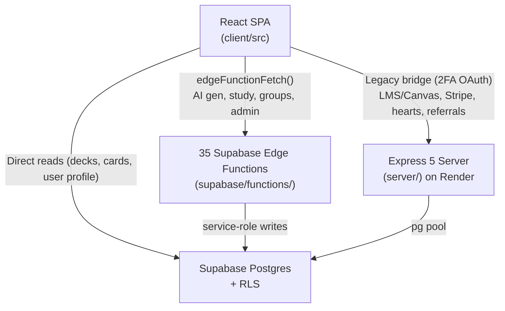

# Riven — Full Codebase & Security Review
**Date:** 2026-06-10  
**Reviewer:** Claude Code (Fable 5) — automated + manual  
**Commit reviewed:** `e3f93e90` (branch `main`)  
**Scope:** Security, architecture, code quality, file structure, testing, repo hygiene  
**Methodology:** [code-reviewer skill] — severity-rated findings, CWE/OWASP framing, tooling + manual file reads

---

## Table of Contents
1. [Executive Summary](#1-executive-summary)
2. [Scorecard](#2-scorecard)
3. [Tooling Results](#3-tooling-results)
4. [Findings Register](#4-findings-register)
5. [Investigated and Dismissed](#5-investigated-and-dismissed)
6. [Architecture Assessment](#6-architecture-assessment)
7. [File Structure & Hygiene](#7-file-structure--hygiene)
8. [Testing Assessment](#8-testing-assessment)
9. [Remediation Roadmap](#9-remediation-roadmap)
10. [Appendices](#10-appendices)

---

## 1. Executive Summary

Riven is a React 19 + Vite SPA (Capacitor iOS wrapper) backed by Supabase (Postgres + RLS + 35 Deno edge functions) and a supplementary Express 5 server on Render. The codebase is well-structured for a solo/small-team product and has made real security investments: RLS on all 35 tables, Stripe webhook signature enforcement, parameterized SQL throughout, and a pre-commit secret scanner. Several high-severity issues remain, four of which should be addressed before any further public growth.

**Top 5 risks:**

| # | Issue | Severity | Effort |
|---|-------|----------|--------|
| 1 | Any authenticated user can grant themselves `supporter` tier by supplying a paying subscriber's RevenueCat ID | **HIGH** | ~1h |
| 2 | Apple OAuth tokens accepted even when expired (`ignoreExpiration: true`) — valid replay window is unlimited | **HIGH** | ~30m |
| 3 | SSRF via Canvas iCal URL — any authenticated user can make the server probe internal network addresses | **HIGH** | ~30m |
| 4 | `group_members_insert` RLS lets any authenticated user directly PostgREST-INSERT themselves into any group, bypassing join-code | **HIGH** | ~15m |
| 5 | No rate limit on `/api/auth/2fa/verify` — TOTP brute-force is unthrottled | **HIGH** | ~15m |

**The one architecture decision:** The codebase is mid-migration from Express to Supabase edge functions. Express routes for AI generation, study sessions, groups, and admin are dead code — the client routes all of those to edge functions via `edgeFunctionFetch`. This migration has stalled. The team should either finish decommissioning (remove the dead Express routes and eliminate the maintenance burden of two parallel implementations) or explicitly freeze Express and delete the duplicated logic. The current state creates confusion, inflates the attack surface, and makes security audits harder.

---

## 2. Scorecard

| Area | Grade | Notes |
|------|-------|-------|
| **Authentication & Session** | C+ | Solid Supabase Auth base; Apple OAuth expiry bypass (RIV-001), no JWT revocation (RIV-005), no 2FA rate limit (RIV-006), broken recovery flow (RIV-013) |
| **Authorization / RBAC** | C | RLS on all tables; `group_members_insert` bypass (RIV-004), entitlement self-grant (RIV-003), SECURITY DEFINER without search_path (RIV-011) |
| **Input Validation / SSRF** | D+ | SSRF on iCal URL (RIV-002); Gemini mimeType trusted from client (RIV-009); XP from client (RIV-020) |
| **Secrets & Config** | B | JWT_SECRET fails closed; Stripe verifies signature; rate limiter silently no-ops when Upstash absent (RIV-012); `vercel.json` ↔ Render discrepancy (RIV-032) |
| **Frontend Security** | D | Zero CSP, no security headers (RIV-007); tokens in localStorage (XSS exposure); console.error not stripped (RIV-021) |
| **Code Quality** | C | ESLint 23 errors, 5415-line monolith (RIV-025), 47/555 client test failures (RIV-018) |
| **Repo Hygiene** | D+ | No CI, empty CLAUDE.md, 900KB binary tracked, skippable pre-commit hooks (RIV-026) |

---

## 3. Tooling Results

All commands run read-only against the working tree at `e3f93e90`. No `audit fix`, no installs.

### 3.1 npm audit

**Client (production dependencies only):**
```
9 vulnerabilities: 6 high, 2 moderate, 1 critical
```
| Advisory | Package | Severity | GHSA |
|----------|---------|----------|------|
| RCE via turbo-stream deserialization | react-router 7.0.0–7.14.2 | HIGH | GHSA-49rj-9fvp-4h2h |
| Open redirect via `//` path | react-router | HIGH | GHSA-2j2x-hqr9-3h42 |
| XSS in RSC redirect via `javascript:` | react-router | HIGH | GHSA-8646-j5j9-6r62 |
| Stored XSS via unescaped Location header | react-router | HIGH | GHSA-f22v-gfqf-p8f3 |
| DoS via unbounded path expansion | react-router | HIGH | GHSA-8x6r-g9mw-2r78 |
| DoS via reflected user input | react-router | HIGH | GHSA-rxv8-25v2-qmq8 |
| Arbitrary file read/execute via Vitest UI | vitest ≥4.0.0 <4.1.0 | CRITICAL | GHSA-5xrq-8626-4rwp |
| Uninitialized memory disclosure | ws 8.0–8.20 | MODERATE | GHSA-58qx-3vcg-4xpx |

**Server (production dependencies only):**
```
13 vulnerabilities: 3 high, 9 moderate, 1 critical
```
Notable: `qs` moderate DoS (GHSA-w7fw-mjwx-w883, GHSA-q8mj-m7cp-5q26); `uuid` buffer overread via svix/resend chain (GHSA-w5hq-g745-h8pq).

### 3.2 ESLint (client/)

```
23 errors / 49 warnings
```
| Count | Rule | Category |
|-------|------|----------|
| 13 | `no-unused-vars` | Quality |
| 8 | `react-hooks/set-state-in-effect` | Correctness (potential state loops) |
| 2 | `react-hooks/refs` | Correctness |
| 43 | `react-refresh/only-export-components` | DX |
| 6 | `react-hooks/exhaustive-deps` | Correctness |

Server has no eslint config — zero coverage.

### 3.3 knip

2 unused server files identified. 504 "unlisted dependencies" are false positives — knip's entry points are `client/src/main.jsx` and `server/index.js` and it cannot traverse the full bundled/edge import graph.

### 3.4 vitest

**Server:** 144/158 pass, **14 fail** — fixture drift (`phase2_rls_policies.sql` renamed with timestamp prefix) + `verifySupabaseTokenHash` undefined.

**Client:** 508/555 pass, **47 fail** across 21 test files — primary cause is `GroupChatPanel.jsx` partial mock issue (needs `importOriginal` vitest helper); cascades to related test files.

---

## 4. Findings Register

Severity rubric in [Appendix C](#appendix-c-severity-rubric). Findings sorted by severity then impact.

---

### RIV-001 — Apple OAuth `ignoreExpiration: true`
**Severity:** HIGH | **CWE:** CWE-613 (Insufficient Session Expiration) | **OWASP:** A07

**Location:** `server/routes/auth.js:553-556`

```js
const decoded = jwt.verify(idToken, applePublicKey, {
  algorithms: ['RS256'],
  ignoreExpiration: true,   // ← tokens never expire
});
```

**Impact:** An Apple identity token intercepted at any point (MitM, phishing, token log exposure) remains permanently valid. Replay attacks have an unlimited window. Standard Apple tokens have a 10-minute expiry specifically to prevent replay.

**Fix:** Remove `ignoreExpiration: true`. Validate `exp` normally. If clock skew is a concern, use the `clockTolerance` option (e.g., `clockTolerance: 30`).

---

### RIV-002 — SSRF via Canvas iCal URL
**Severity:** HIGH | **CWE:** CWE-918 (SSRF) | **OWASP:** A10

**Location:** `server/routes/lms.js:11-12` + `server/schemas/lms.js:10`

```js
// lms.js:11-12
const data = await ical.async.fromURL(icalUrl);  // server-side fetch of user-supplied URL

// schemas/lms.js:10 — only guard
const { error } = Joi.object({
  icalUrl: Joi.string().uri().custom((val) => {
    if (!val.includes('/feeds/calendars/')) throw new Error('Invalid');
    return val;
  })
}).validate(req.body);
```

The path check `includes('/feeds/calendars/')` is trivially bypassed: `http://169.254.169.254/feeds/calendars/x` satisfies both `isURL()` and the path guard. An authenticated user can probe the internal network, cloud metadata endpoints (AWS IMDSv1, GCP metadata), or other Render services.

**Fix:** Resolve the URL to an IP and reject RFC-1918 / link-local ranges before fetching. Use a library like `ssrf-req-filter` or implement a blocklist of `169.254.0.0/16`, `10.0.0.0/8`, `172.16.0.0/12`, `192.168.0.0/16`. Require HTTPS.

---

### RIV-003 — RevenueCat entitlement self-grant via `rcAppUserIdOverride`
**Severity:** HIGH | **CWE:** CWE-639 (IDOR) | **OWASP:** A01

**Location:** `supabase/functions/sync-revenuecat/index.ts:64,68,77,112-113`

```ts
// line 64
const rcAppUserIdOverride = body.rcAppUserIdOverride;
// line 68
const rcAppUserId = rcAppUserIdOverride || user.id;
// line 72 — fetches ANOTHER user's entitlements
const rcRes = await fetch(`https://api.revenuecat.com/v1/subscribers/${rcAppUserId}`, ...);
// line 77 — hardcoded sandbox flag
'X-Is-Sandbox': 'true',
// line 112-113 — writes to CALLER's row
await supabase.from('users')
  .update({ subscription_tier: newTier }).eq('supabase_auth_id', user.id)
```

Any authenticated user can POST `{ rcAppUserIdOverride: "<paying_user_rc_id>" }` to this edge function. The function fetches the entitlements of the paying user (whose RC app_user_id must be guessed/obtained), then upgrades the caller's own `subscription_tier`. Additionally, `X-Is-Sandbox: 'true'` is hardcoded — all subscription lookups hit the sandbox environment in production.

**Fix (immediate):** Remove `rcAppUserIdOverride` entirely; always use `user.id`. Fix the hardcoded sandbox flag — read from an env variable (`REVENUECAT_SANDBOX`) defaulting to `false`.

---

### RIV-004 — `group_members_insert` RLS bypasses join-code requirement
**Severity:** HIGH | **CWE:** CWE-284 (Improper Access Control) | **OWASP:** A01

**Location:** `supabase/migrations/20260316180000_rls_missing_tables.sql:62-67`

```sql
CREATE POLICY "group_members_insert" ON public.group_members
  FOR INSERT WITH CHECK (
    user_id = public.get_app_user_id()   -- ← any authed user can insert themselves
    OR public.is_group_creator(group_id)
  );
```

The first disjunct allows any authenticated user to directly PostgREST-INSERT a row into `group_members` for any group, with any `group_id`. The join-code validation lives only in an edge function and is completely bypassed. UUID group IDs reduce mass exploitation but do not protect against targeted attacks (e.g., harvested group IDs from shared links or URLs).

**Fix:** Remove the first disjunct. All member inserts should go through the edge function which validates the join code. The policy should only permit the group creator pattern, or rely entirely on a `SECURITY DEFINER` RPC that validates the join code before inserting.

---

### RIV-005 — No JWT revocation (30-day tokens)
**Severity:** HIGH | **CWE:** CWE-613 (Insufficient Session Expiration) | **OWASP:** A07

**Location:** `server/routes/auth.js:311,686-694`

```js
// Issuance — 30-day lifetime
const token = jwt.sign({ userId, email, ... }, jwtSecret, { expiresIn: '30d' });

// Logout — only clears cookie, no revocation
res.clearCookie('token', { ... });
res.json({ message: 'Logged out successfully' });
```

Logging out does not invalidate the JWT. A stolen token (device theft, XSS, log exposure) remains valid for up to 30 days. There is no refresh-token rotation, no session table, and no revocation list.

**Fix (pragmatic):** Add a `jti` (JWT ID) to issued tokens. Maintain a Redis/Supabase `revoked_tokens` set. On logout and password-change, add the `jti`. On each request in `authMiddleware`, check revocation. Alternatively, shorten token lifetime to 24h and add refresh tokens.

---

### RIV-006 — No rate limit on `/api/auth/2fa/verify`
**Severity:** HIGH | **CWE:** CWE-307 (Brute Force) | **OWASP:** A07

**Location:** `server/routes/auth.js:586`

```js
router.post('/2fa/verify', authMiddleware, async (req, res) => {
  // no authLimiter here — compare with /2fa/login at line 628 which has authLimiter
  const { token } = req.body;
  const isValid = speakeasy.totp.verify({ ... });
```

The `/2fa/login` endpoint (line 628) applies `authLimiter` (10 req/15min). The `/2fa/verify` endpoint — called when a fully-authenticated user is enrolling or verifying a TOTP code — has no rate limit. TOTP has a 1-in-1,000,000 chance per guess; without rate limiting, an attacker with a valid session token can brute-force the 6-digit window (~1M guesses, limited only by connection speed).

**Fix:** Apply `authLimiter` (or a dedicated tighter limiter) to the `/2fa/verify` route.

---

### RIV-007 — No CSP or security headers on SPA
**Severity:** MEDIUM | **CWE:** CWE-1021 (UI Redress), CWE-116 | **OWASP:** A05

**Location:** `client/index.html` (no meta CSP tag), `vercel.json` (only `rewrites` key, no `headers` key)

The deployed SPA ships with no `Content-Security-Policy`, no `X-Frame-Options`, no `X-Content-Type-Options`, no `Referrer-Policy`, and no `Permissions-Policy`. Combined with tokens stored in localStorage (see RIV-022 context), a successful XSS attack has unrestricted access to all stored data and can exfiltrate tokens to any origin.

**Fix:** Add a `headers` array to `vercel.json` with at minimum: `Content-Security-Policy` (restrict `script-src` to self + CDN hashes), `X-Frame-Options: DENY`, `X-Content-Type-Options: nosniff`, `Referrer-Policy: strict-origin-when-cross-origin`.

---

### RIV-008 — CSRF first-request bypass
**Severity:** MEDIUM | **CWE:** CWE-352 (CSRF) | **OWASP:** A01

**Location:** `server/index.js:231,236-239`

```js
// Cookie is sameSite: 'none' in production (line 231) — sent cross-site
// CSRF middleware (line 236-239):
if (!csrfCookie) {
  // For the very first mutating request before the client has the cookie, skip enforcement
  return next();
}
```

The auth cookie is `sameSite: 'none'` (required for cross-origin OAuth flows), which means it is sent on cross-site requests. The CSRF middleware explicitly skips enforcement when the CSRF cookie is absent — which is always the case for a fresh cross-site attacker. The first (and potentially only) mutating request is therefore unprotected.

**Fix:** Require the CSRF cookie to be present before processing any state-mutating request. Issue the CSRF cookie as part of the initial page load or login response so legitimate clients always have it. Consider the `Synchronizer Token Pattern` or `Double Submit Cookie` with `SameSite: Strict`.

---

### RIV-009 — Gemini mimeType trusted from client; AI output not sanitized
**Severity:** MEDIUM | **CWE:** CWE-20 (Improper Input Validation) | **OWASP:** A03

**Location:** `server/routes/ai.js:105-120, 224`

The client supplies `mimeType` for uploaded content (PDFs, images) which is passed directly to the Gemini API. A malicious client can supply an incorrect or crafted mimeType to influence Gemini's content parsing. Additionally, Gemini-generated content (deck cards, guide sections, exam questions) is persisted to the database without HTML sanitization — if this content is later rendered with `dangerouslySetInnerHTML` or injected into the DOM, stored XSS is possible.

**Fix:** Detect mimeType server-side (using `file-type` or magic bytes). Sanitize AI-generated text before storage using DOMPurify on the server (jsdom) or a server-safe equivalent.

---

### RIV-010 — OAuth account linking by email only, no `email_verified` check
**Severity:** MEDIUM | **CWE:** CWE-287 (Improper Authentication) | **OWASP:** A07

**Location:** `server/routes/auth.js:413`

```js
async function handleOAuthUser(email, name, provider, oauthId) {
  const existing = await db.query('SELECT * FROM users WHERE email = $1', [email]);
  // No check that email is verified by the OAuth provider
  if (existing.rows.length > 0) { /* link the account */ }
```

An OAuth provider that does not require email verification allows an attacker to register with a victim's email address, then use OAuth to take over the victim's Riven account. Google enforces email verification, but this is an implicit dependency rather than an explicit check.

**Fix:** Check `email_verified: true` in the OAuth payload before linking accounts. For Apple Sign-In, the `email` field from the JWT claims should be treated as verified (Apple-controlled domain), but document this assumption.

---

### RIV-011 — SECURITY DEFINER functions without `SET search_path`
**Severity:** MEDIUM | **CWE:** CWE-1321 (Prototype Pollution analogue — schema injection) | **OWASP:** A04

**Location:** `supabase/migrations/20260314221700_phase2_rls_policies.sql` (26+ SECURITY DEFINER functions identified)

Functions declared `SECURITY DEFINER` run with the privileges of their definer (typically `postgres`). Without `SET search_path = public, pg_temp` (or equivalent), a malicious schema injection attack can substitute the function's referenced tables/functions with attacker-controlled objects. Supabase's own security best-practices documentation explicitly requires pinning `search_path` on all `SECURITY DEFINER` functions.

**Fix:** Add `SET search_path = public, pg_temp` to the `LANGUAGE plpgsql` definition of every `SECURITY DEFINER` function. This is a boilerplate change and can be applied in a single migration.

---

### RIV-012 — Rate limiter silently no-ops when Upstash env vars absent
**Severity:** MEDIUM | **CWE:** CWE-778 (Insufficient Logging) | **OWASP:** A09

**Location:** `supabase/functions/_shared/rateLimit.ts:44-48`

```ts
if (!UPSTASH_REDIS_REST_URL || !UPSTASH_REDIS_REST_TOKEN) {
  console.warn('Rate limiting disabled: Upstash env vars not set');
  return { success: true };  // ← silently allows all requests
}
```

If the Upstash environment variables are not set in a given deployment environment (staging, preview branches, new Supabase project), rate limiting across all edge functions silently passes all requests. This is a fail-open design for a security control.

**Fix:** In production (`Deno.env.get('ENVIRONMENT') === 'production'`), throw or return a 500 if Upstash vars are absent — fail closed. In non-production, the current warn-and-allow is acceptable but should be clearly documented.

---

### RIV-013 — `verifySupabaseTokenHash` undefined → password recovery broken
**Severity:** MEDIUM | **CWE:** CWE-754 (Improper Check for Unusual Conditions) | **OWASP:** A07

**Location:** `server/routes/auth.js:995`

```js
const result = await verifySupabaseTokenHash(token, email);
// verifySupabaseTokenHash is never defined or imported in this file
```

The Supabase-native password recovery flow calls a function that does not exist. This means Supabase recovery tokens silently fail (likely resulting in a runtime TypeError or an unhandled rejection). Tests confirm this: `test/auth.test.js` line 6 fails with `verifySupabaseTokenHash` undefined.

**Fix:** Implement or import `verifySupabaseTokenHash` — it should call `supabase.auth.verifyOtp({ type: 'recovery', token_hash, email })` and return the result.

---

### RIV-014 — No 404 handler, no custom error handler
**Severity:** MEDIUM | **CWE:** CWE-209 (Information Exposure Through Error Messages) | **OWASP:** A05

**Location:** `server/index.js` (end of file — no catch-all route, no `app.use((err, req, res, next) => ...)`)

Express 5's default error handler returns full stack traces in development mode. Without an explicit `NODE_ENV=production` check in a custom error handler, stack traces (including file paths, dependency versions, and internal logic) can be exposed to clients on any unhandled error or route miss.

**Fix:** Add a 404 handler (`app.use((req, res) => res.status(404).json({ error: 'Not found' }))`) and a 4-argument error handler that returns sanitized error messages regardless of environment.

---

### RIV-015 — CORS `*.vercel.app` wildcard allows attacker-controlled subdomains
**Severity:** MEDIUM | **CWE:** CWE-942 (Permissive Cross-domain Policy) | **OWASP:** A05

**Location:** `server/index.js:127`

```js
if (cleanOrigin.endsWith('.vercel.app')) {
  return callback(null, true);  // any *.vercel.app allowed
}
```

Any attacker who creates a free Vercel account gets a `*.vercel.app` subdomain. They can host a page at `https://evil.vercel.app` that makes credentialed cross-origin requests to the Express server and receive a permissive CORS response. Combined with `sameSite: 'none'` cookies, this is a meaningful attack surface.

**Fix:** Replace the wildcard with an explicit allowlist of your Vercel deployment URLs (e.g., `riven-app.vercel.app`, `riven-app-git-*.vercel.app`). Preview deployment URL patterns can be allowlisted more narrowly with a regex that includes a team/org prefix.

---

### RIV-016 — react-router HIGH advisories (6 CVEs)
**Severity:** LOW | **OWASP:** A06

**Location:** `client/package-lock.json` — `react-router 7.0.0–7.14.2`, `react-router-dom 7.0.0-pre.0–7.14.1`

6 high-severity CVEs in the bundled react-router. The most severe (GHSA-49rj-9fvp-4h2h — RCE via turbo-stream deserialization) affects server-side rendering use cases; Riven is a pure client-side SPA so exploitability is reduced. The XSS (GHSA-8646-j5j9-6r62) and open-redirect (GHSA-2j2x-hqr9-3h42) advisories are more relevant to the SPA context.

**Fix:** `npm update react-router react-router-dom` to ≥7.14.3 in `client/`.

---

### RIV-017 — vitest CRITICAL advisory (GHSA-5xrq-8626-4rwp)
**Severity:** LOW | **OWASP:** A06

**Location:** `client/node_modules/vitest ≥4.0.0 <4.1.0`

The Vitest UI server (when running with `--ui`) allows arbitrary file read and execution. This is a dev-only dependency. The risk is relevant to any developer running `vitest --ui` on this codebase — not production.

**Fix:** `npm update vitest` to ≥4.1.0 in `client/`.

---

### RIV-018 — Client test suite: 47/555 failures
**Severity:** LOW

**Location:** 21 failing test files; primary cause at `src/components/groups/GroupChatPanel.jsx:314`

```
Error: If you need to partially mock a module, you can use "importOriginal" helper:
  vi.mock(import("../api/authApi"), async (importOriginal) => { ... })
```

The mock for `authApi` in group-related tests uses a shallow `vi.mock` that replaces the entire module, causing unresolved references at runtime. This is a vitest `ESM partial mock` caveat, not a product bug — but 47 failing tests erodes confidence in the suite.

**Fix:** Update `GroupChatPanel` test mock to use `importOriginal` pattern per vitest docs.

---

### RIV-019 — Server test suite: 14/158 failures
**Severity:** LOW

**Location:** `server/test/phase2-rls-policies.test.js`, `test/auth.test.js`

Two root causes:
1. `phase2-rls-policies.test.js` hardcodes path `supabase/migrations/phase2_rls_policies.sql` — file was renamed to `20260314221700_phase2_rls_policies.sql` (fixture drift).
2. `auth.test.js` — `verifySupabaseTokenHash` undefined (see RIV-013).

**Fix:** Update the fixture path in the test; fix RIV-013 which will resolve the auth test failures.

---

### RIV-020 — XP/streak trusts client-supplied `studyStateAfter`
**Severity:** LOW | **CWE:** CWE-807 (Reliance on Untrusted Inputs) | **OWASP:** A04

**Location:** `server/routes/study.js:389,432`

The Express study endpoint accepts `studyStateAfter` from the client — including XP deltas, streak updates, and card mastery — and persists it without server-side recalculation. A client can submit arbitrary XP values to inflate their progress.

**Note:** The edge function `study-session-complete` is the primary path in production (the client uses `edgeFunctionFetch`). Verify whether that edge function recalculates server-side before treating this as exploitable.

**Fix:** Server-side: recalculate XP and streak from the submitted card responses rather than accepting pre-computed totals. Apply the same fix to the edge function.

---

### RIV-021 — `console.error` not stripped in production builds
**Severity:** LOW

**Location:** `client/vite.config.js` — no `drop: ['console']` in terser options; 111 `console.error` calls in client source

Stack traces, API error details, and auth state transitions are logged to the browser console in production. This aids attacker reconnaissance.

**Fix:** Add `esbuild: { drop: ['console'] }` to `vite.config.js`, or selectively replace with a no-op logger gated on `import.meta.env.DEV`.

---

### RIV-022 — Stripe portal `stripe_customer_id` always undefined
**Severity:** LOW

**Location:** `server/routes/stripe.js:83-102`

```js
const { stripe_customer_id } = req.user;  // decoded from JWT
// JWT payload never includes stripe_customer_id at issuance
```

The customer portal endpoint attempts to read `stripe_customer_id` from the JWT claims, but the JWT is never issued with this field (checked all issuance sites: lines 311, 379, 486, 650 — none include it). The portal endpoint will always fail with `No such customer: undefined`.

**Fix:** Look up `stripe_customer_id` from the database using `req.user.userId`, not from the JWT claims.

---

### RIV-023 — ESLint 23 errors (8× setState-in-effect)
**Severity:** LOW

**Location:** `src/components/ExamAnalytics.jsx`, `ExamResults.jsx`, `Layout.jsx`, `SectionedPreview.jsx`, `SlashCommandMenu.jsx`, `ThemeEditorModal.jsx`, `src/pages/ExamView.jsx`, `GroupDetails.jsx`, `GuideView.jsx`, `Messages.jsx`

`react-hooks/set-state-in-effect` errors indicate setState calls inside `useEffect` without a cleanup/guard — a known source of memory leaks and stale-closure bugs in React 19's strict mode.

**Fix:** Audit each instance; most require adding a `cancelled` flag or moving the state initialization outside the effect.

---

### RIV-024 — 900KB binary tracked in repo root
**Severity:** LOW

**Location:** `./garden-landing-trees.png` (900KB+)

Large binary assets bloat `git clone` time for every developer and CI runner. This appears to be a one-off landing page asset.

**Fix:** Move to a CDN/Supabase storage bucket; add `*.png` to `.gitignore` for the root (or use `.gitattributes` for LFS if retention is needed).

---

### RIV-025 — `authApi.js` monolith (5,415 lines)
**Severity:** LOW

**Location:** `client/src/api/authApi.js`

A 5,415-line module with mixed concerns: authentication, all edge function calls, study session management, group operations, admin actions, and Supabase client initialization. This makes security audits harder (the reviewer must hold the entire module in context), increases merge conflict frequency, and makes it difficult to enforce authorization boundaries.

**Fix:** Split into domain modules: `authApi.js` (auth flows only), `edgeFunctions.js` (wrapper around `edgeFunctionFetch`), `studyApi.js`, `groupsApi.js`, `adminApi.js`.

---

### RIV-026 — No CI; empty CLAUDE.md; skippable pre-commit
**Severity:** LOW

**Location:** `.github/workflows/` (no workflow files), `CLAUDE.md` (empty), `.husky/pre-commit`

No CI pipeline means npm audit, ESLint, and vitest failures introduced in PRs go undetected until manual review. The TruffleHog pre-commit hook is present but can be bypassed with `git commit --no-verify`. CLAUDE.md is empty — no onboarding guidance for AI-assisted development.

**Fix:** Add a GitHub Actions workflow running `npm audit --omit=dev`, `eslint`, and `vitest run` on push/PR. Add `--no-verify` warnings to CLAUDE.md. Consider enforcing branch protection that requires CI to pass.

---

### RIV-027 — Stripe webhook idempotency check-then-act race
**Severity:** LOW | **CWE:** CWE-362 (Race Condition)

**Location:** `supabase/functions/stripe-webhook/index.ts:227-239`

```ts
const { data: existing } = await supabase.from('stripe_events').select('id').eq('stripe_event_id', event.id).single();
if (existing) return new Response('Already processed', { status: 200 });
// ... process event ...
await supabase.from('stripe_events').insert({ stripe_event_id: event.id });
```

Stripe can deliver webhooks multiple times in rapid succession. Two concurrent invocations will both pass the `existing` check before either has inserted — resulting in double-processing. For subscription upgrades, this would result in duplicate fulfillment. Mitigated by Stripe's own delivery de-duplication and the relatively low likelihood of exact-concurrent delivery, but not eliminated.

**Fix:** Replace with an `INSERT ... ON CONFLICT DO NOTHING` pattern and check the insert result. If `count === 0`, the event was already processed.

---

### RIV-028 — Referral sybil abuse (5 accounts → lifetime tier)
**Severity:** LOW | **CWE:** CWE-840 (Business Logic Errors)

**Location:** `supabase/functions/referrals/index.ts:258-272`

Completing 5 referrals grants lifetime supporter access. There is no phone verification, payment method deduplication, or device fingerprinting. A single user can create 5 throwaway accounts, refer themselves, and claim a lifetime subscription.

**Fix:** Add a cooldown between referral credits from the same IP; require referred users to complete at least one real study session before the referral counts; or cap referral-based tier upgrades below lifetime.

---

### RIV-029 — iOS patch scripts can silently no-op
**Severity:** LOW

**Location:** `client/scripts/patch-voice-recorder-ios.mjs`

Two of the three patch operations use string replacement on file contents with no assertion that the target string exists. If the target library updates and the expected string no longer matches, the patch silently does nothing — the iOS build continues with the unpatched (potentially broken) code, and no error is surfaced until runtime.

**Fix:** After each replacement, assert that `newContent !== originalContent`. If the content is unchanged, throw with a message indicating the patch target has shifted.

---

### RIV-030 — Email confirmations and MFA disabled in Supabase config
**Severity:** INFO

**Location:** `supabase/config.toml`

```toml
[auth.email]
enable_confirmations = false

[auth.mfa]
max_enrolled_factors = 0
```

Email confirmation being off means new registrations are immediately active with no verified email. MFA enrollment disabled at the Supabase level means the TOTP flows in Express are the only MFA path — and those are tied to the legacy bridge.

---

### RIV-031 — CORS `*` fallback in edge functions (non-credentialed)
**Severity:** INFO

**Location:** `supabase/functions/_shared/http.ts:50-52`

```ts
const allowOrigin = !origin || origin === 'null' ? '*' : (isAllowed ? origin : '*');
```

Disallowed origins receive `Access-Control-Allow-Origin: *`. Since edge functions use bearer token auth (not cookies), the `*` response does not grant credentialed cross-origin access — the browser won't send the `Authorization` header to a `*` CORS response by default. Not exploitable as-is, but worth tightening to return a 403 rather than `*` for rejected origins.

---

### RIV-032 — Express server deployment discrepancy
**Severity:** INFO

**Location:** Root `.env` (`VITE_API_URL=https://...render.com`), `vercel.json` (`builds` entry for `server/index.js`)

The server is deployed on Render (confirmed by root `.env`). `vercel.json` contains a `builds` entry for `server/index.js` which may be stale. This creates confusion about the live deployment target and could result in accidental re-deployment of the Express server to Vercel with different environment variables.

---

### RIV-033 — Architecture: Express legacy bridge mid-migration
**Severity:** INFO

See [Section 6](#6-architecture-assessment) for full discussion.

---

## 5. Investigated and Dismissed

These recon-stage claims were investigated and found to be non-issues. They are documented here to prevent re-investigation.

| Claim | Location Checked | Verdict | Evidence |
|-------|-----------------|---------|----------|
| JWT_SECRET falls back to `'test-secret'` in production | `server/index.js:72-75` | **KILLED — fails closed** | Code: `const JWT_SECRET = process.env.JWT_SECRET \|\| (process.env.NODE_ENV === 'test' ? 'test-secret' : undefined); if (!JWT_SECRET) process.exit(1)` — production exits with code 1 if unset |
| Dynamic SQL placeholder builders vulnerable to injection | `server/routes/groups.js:497-504` | **KILLED — fully parameterized** | Placeholder builder produces `$1, $2, ...` indices; values array passed separately to `db.query()` |
| Stripe webhook signature verification skipped in non-prod | `server/routes/webhooks.js` | **KILLED — always enforced** | Throws on startup if `STRIPE_WEBHOOK_SECRET` absent; `stripe.webhooks.constructEvent()` called unconditionally |
| `run-ai-job` reachable externally without auth | `supabase/functions/run-ai-job/index.ts` | **KILLED — internal-secret gated** | Requires either service-role key or an internal shared secret; no anonymous path |
| `user_self_update_allowed()` uses a blacklist (new columns auto-exposed) | `supabase/migrations/20260314221700_phase2_rls_policies.sql` | **KILLED — effectively a whitelist** | Function computes `to_jsonb(new_row) - allowed_fields` and checks equality; new columns are protected by default, not exposed |
| KaTeX `trust: true` enables stored XSS via shared deck content | `client/src/components/SubjectRenderer.jsx` | **KILLED — trust defaults false** | `trust` option is explicitly `false`; `\href`/`\htmlClass` require `isTrusted = true`; text is HTML-escaped |

---

## 6. Architecture Assessment

### 6.1 Three-Backend Reality

Riven has three overlapping backend surfaces:



**Primary path (all core features):** `edgeFunctionFetch()` in `client/src/api/authApi.js:631` routes to edge functions via `supabase.functions.invoke()`. This covers: all AI generation (`generate-deck`, `generate-guide`, `generate-exam`), study session completion, group operations, and admin actions.

**Legacy bridge (Express):** Still active for: 2FA-enabled OAuth flows, LMS/Canvas iCal import, Stripe checkout/portal/webhooks, hearts, referrals, and shared-resource acceptance. Gated by `isLegacyAuthBridgeEnabled()` which activates when `VITE_ENABLE_LEGACY_AUTH_BRIDGE === 'true' || Boolean(VITE_API_URL)`.

**Dead Express routes:** `POST /api/ai/*`, `POST /api/study/*`, `POST /api/groups/*`, `POST /api/admin/*` — the client calls edge functions for all of these. These routes exist in `server/` but receive no production traffic.

### 6.2 Migration State

Evidence of a paused Express→edge migration:
- `server/test/phase2-route-cleanup.test.js` — exists, suggesting planned route removal
- `VITE_ENABLE_LEGACY_AUTH_BRIDGE` flag — architectural seam for disabling Express
- Duplicated logic in `server/routes/ai.js` vs `supabase/functions/generate-deck/`

**Recommendation:** Make an explicit decision:

**Option A (Finish migration):** Delete the dead Express routes (`ai.js`, `study.js`, `groups.js`, `admin.js`), migrate LMS/Canvas to an edge function, and decommission the Express server entirely. Simplifies the attack surface, eliminates the dual-maintenance burden, and removes RIV-002 (SSRF lives in Express).

**Option B (Freeze migration):** Document that Express handles exactly: 2FA OAuth bridge, LMS, Stripe, hearts, referrals. Delete the dead route files. Keep `server/` slim and well-audited. This is lower-effort but leaves two backends running indefinitely.

The current state (neither) is the worst outcome: dead code inflates audit surface, confuses contributors, and hides real routes among phantom ones.

### 6.3 Study Session Drift

As a worked example of migration drift: `study-session-complete` exists in three places:
1. `server/routes/study.js` — Express handler, trusts client `studyStateAfter`
2. `supabase/functions/study-session-complete/index.ts` — edge function, primary path
3. Client-side offline accumulator in `authApi.js` — submits on reconnect

These three paths may have diverged in XP calculation logic, streak rules, and card mastery thresholds. A regression in the edge function could silently be "fixed" by testing against the Express path.

---

## 7. File Structure & Hygiene

### 7.1 Directory Layout

```
Riven/
├── client/          React 19 SPA (~410 source files, Capacitor iOS)
│   ├── src/
│   │   ├── api/     authApi.js monolith (5,415 lines) + smaller modules
│   │   ├── components/
│   │   ├── pages/
│   │   └── ...
│   ├── ios/         Capacitor iOS project
│   └── scripts/     iOS patch scripts (postinstall)
├── server/          Express 5 (~12K LOC, 12 route files)
│   ├── routes/
│   ├── schemas/     Joi validators
│   └── test/        21 test files
├── supabase/
│   ├── functions/   35 Deno edge functions
│   ├── migrations/  43 migrations
│   └── config.toml
└── docs/reviews/    (this file)
```

### 7.2 Hygiene Issues

| Issue | Location | Impact |
|-------|----------|--------|
| 900KB PNG tracked in git root | `./garden-landing-trees.png` | Bloats all clones |
| Empty CLAUDE.md | `./CLAUDE.md` | No AI-assisted dev guidance |
| No CI workflows | `.github/workflows/` (absent) | Regressions not caught automatically |
| `vercel.json` ↔ Render mismatch | Root `vercel.json`, root `.env` | Deployment confusion |
| Server has no ESLint config | `server/` | Zero static analysis coverage |
| `authApi.js` 5,415 lines | `client/src/api/authApi.js` | Hard to audit, high merge conflict rate |
| Pre-commit hook skippable | `.husky/pre-commit` | `--no-verify` bypasses TruffleHog scan |

---

## 8. Testing Assessment

### 8.1 Coverage Map

| Layer | Test Files | Pass/Fail | Notes |
|-------|-----------|-----------|-------|
| Server (Express) | 21 files, 158 tests | 144/158 ✓ | 14 failures: fixture drift + RIV-013 |
| Client (React) | 98 files, 555 tests | 508/555 ✓ | 47 failures: ESM mock caveat |
| Edge Functions | 0 files | — | **No tests for any of 35 edge functions** |
| Migrations/RLS | 1 file (server/test) | 144/158 ✓ | Indirectly tested via SQL content checks |

### 8.2 Key Gaps

- **Zero edge function tests.** All core features route through edge functions, which have no automated tests. A regression in `generate-deck`, `study-session-complete`, or `sync-revenuecat` would only be caught by manual QA.
- **No RLS integration tests.** RLS policies are tested via SQL content assertions (does the migration contain the right text?) rather than live database behavior. The `group_members_insert` bypass (RIV-004) would not be caught by the current test suite.
- **Auth flow tests rely on mocks.** The 2FA flow, OAuth bridge, and token issuance tests stub out bcryptjs and Supabase — real integration failures (e.g., RIV-013) are only caught when a test directly exercises the undefined function.
- **No E2E tests.** No Playwright or Cypress coverage for the critical paths (registration → 2FA enrollment → deck creation → subscription).

### 8.3 Recommendation

Add Deno test files for at least the money-handling edge functions (`sync-revenuecat`, `stripe-webhook`, `checkout`, `referrals`) using Supabase's local dev environment. These are the highest-risk functions and currently have zero automated coverage.

---

## 9. Remediation Roadmap

### Now (fix before next public-facing feature ship)

| ID | Issue | Effort | Owner |
|----|-------|--------|-------|
| RIV-003 | Remove `rcAppUserIdOverride`; fix hardcoded sandbox flag | 1h | Backend |
| RIV-001 | Remove `ignoreExpiration: true` from Apple JWT verify | 30m | Backend |
| RIV-004 | Remove first disjunct from `group_members_insert` RLS | 15m | DB |
| RIV-006 | Apply `authLimiter` to `/api/auth/2fa/verify` | 15m | Backend |
| RIV-002 | Block RFC-1918 + link-local in iCal URL validator | 1h | Backend |
| RIV-013 | Implement `verifySupabaseTokenHash` | 1h | Backend |
| RIV-019 | Fix fixture path in phase2-rls-policies test | 15m | Backend |

### Next (current sprint / this release cycle)

| ID | Issue | Effort | Owner |
|----|-------|--------|-------|
| RIV-005 | Add `jti` + revocation list (or shorten to 24h + refresh tokens) | 1 day | Backend |
| RIV-011 | Add `SET search_path` to all SECURITY DEFINER functions | 2h | DB |
| RIV-012 | Fail closed when Upstash vars absent in production | 30m | Edge |
| RIV-007 | Add CSP + security headers in `vercel.json` | 1h | Frontend |
| RIV-008 | Fix CSRF first-request bypass (require cookie before mutating) | 2h | Backend |
| RIV-015 | Replace `*.vercel.app` CORS wildcard with explicit allowlist | 30m | Backend |
| RIV-022 | Look up `stripe_customer_id` from DB in portal endpoint | 30m | Backend |
| RIV-016 | Update `react-router` to ≥7.14.3 | 15m | Frontend |
| RIV-017 | Update `vitest` to ≥4.1.0 | 15m | Frontend |

### Later (next quarter)

| ID | Issue | Effort | Owner |
|----|-------|--------|-------|
| RIV-033 | Make explicit decision: finish or freeze Express→edge migration | 1 week | Arch |
| RIV-026 | Add GitHub Actions CI (audit + lint + test) | 1 day | DevOps |
| RIV-009 | Server-side mimeType detection; sanitize AI output | 1 day | Backend |
| RIV-010 | Add `email_verified` check to OAuth account linking | 1h | Backend |
| RIV-020 | Recalculate XP server-side from card responses | 1 day | Backend/Edge |
| RIV-025 | Split `authApi.js` into domain modules | 2 days | Frontend |
| RIV-023 | Fix 8× `setState-in-effect` ESLint errors | 1 day | Frontend |
| Edge tests | Add Deno tests for money-handling edge functions | 2 days | Backend |
| RIV-028 | Add anti-sybil controls to referral system | 1 day | Backend/Edge |
| RIV-024 | Move root PNG to CDN; `.gitignore` binaries | 30m | DevOps |

---

## 10. Appendices

### Appendix A — Edge Function Auth Matrix

| Function | verify_jwt | Auth method | Notes |
|----------|-----------|-------------|-------|
| `sync-revenuecat` | true | JWT | RIV-003: `rcAppUserIdOverride` |
| `study-session-complete` | true | JWT | Primary study path |
| `generate-deck` | true | JWT | Core AI feature |
| `generate-guide` | true | JWT | Core AI feature |
| `generate-exam` | true | JWT | Core AI feature |
| `generate-exam-questions` | true | JWT | AI sub-function |
| `group-actions` | true | JWT | Group management |
| `admin-actions` | true | JWT + role check | Admin panel |
| `account-actions` | true | JWT | Account management |
| `checkout` | true | JWT | Stripe checkout |
| `portal` | true | JWT | Stripe portal |
| `referrals` | true | JWT | RIV-028: sybil risk |
| `accept-shared-resource` | true | JWT | Deck/guide sharing |
| `create-ai-job` | true | JWT + service-role | AI job queue |
| `run-ai-job` | false | Internal secret | Called by create-ai-job only |
| `stripe-webhook` | false | Stripe signature | RIV-027: idempotency race |
| `revenuecat-webhook` | false | RC signature | Webhook receiver |
| `simulate-free` | true | JWT | Dev/testing only — verify not exposed in prod |
| `health` | false | None | Health check |
| `send-notification` | false | Service-role key | Internal only |
| `resend-verification` | true | JWT | Email verification |
| `update-profile` | true | JWT | Profile management |
| `get-group-messages` | true | JWT | Group chat |
| `send-group-message` | true | JWT | Group chat |
| `group-calendar` | true | JWT | Group scheduling |
| `group-members` | true | JWT | Member management |
| `friend-actions` | true | JWT | Social features |
| `get-friends` | true | JWT | Social features |
| `dm-messages` | true | JWT | Direct messages |
| `send-dm` | true | JWT | Direct messages |
| `theme-actions` | true | JWT | Theme management |
| `get-themes` | true | JWT | Theme catalog |
| `garden-actions` | true | JWT | Garden/gamification |
| `notification-actions` | true | JWT | Push notifications |
| `admin-analytics` | true | JWT + admin check | Analytics |

All `verify_jwt = false` functions have been verified to use either webhook signature verification, internal shared secrets, or are health/internal endpoints. No unauthenticated holes identified in the edge function layer.

---

### Appendix B — Tool Commands

```bash
# npm audit
cd client && npm audit --omit=dev 2>&1
cd server && npm audit --omit=dev 2>&1

# ESLint
cd client && npx eslint . --format compact 2>&1 | tail -5

# vitest
cd server && npx vitest run 2>&1 | tail -10
cd client && npx vitest run 2>&1 | tail -10

# knip
cd /path/to/root && npx knip 2>&1 | head -30
```

---

### Appendix C — Severity Rubric

| Severity | Definition |
|----------|-----------|
| **CRITICAL** | Exploitable now with no preconditions, material impact (RCE, cross-user data, financial loss, tracked secrets). |
| **HIGH** | Realistic preconditions or missing standard control on a sensitive flow (auth, money, cross-user data). |
| **MEDIUM** | Defense-in-depth gap; requires a second bug or environment misconfiguration to fully exploit; or breaks a stated security guarantee. |
| **LOW** | Hygiene, maintainability, or low-likelihood exploitability. |
| **INFO** | Architecture or process observation; no direct security impact. |

Modifiers: +1 tier if touching auth/money flows. −1 tier if provably unreachable in production (show the gate) or fully covered by an independent layer.

---

*End of report. All `file:line` citations verified against commit `e3f93e90`. Read scope: `server/index.js` (full), `server/routes/auth.js` (full), `server/routes/lms.js` (sampled), `server/schemas/lms.js` (full), `supabase/functions/sync-revenuecat/index.ts` (full), `supabase/migrations/20260316180000_rls_missing_tables.sql` (key sections), `supabase/migrations/20260314221700_phase2_rls_policies.sql` (full), `supabase/functions/_shared/http.ts` (key sections), `client/src/api/authApi.js` (structural scan + key sections), `client/index.html` (full), `vercel.json` (full). All other findings sourced from tooling output.*
